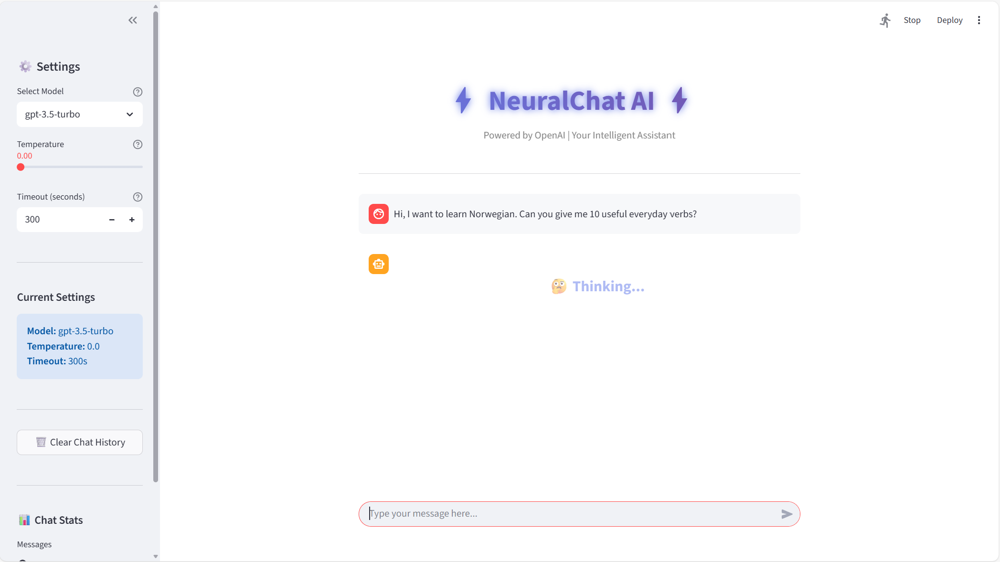
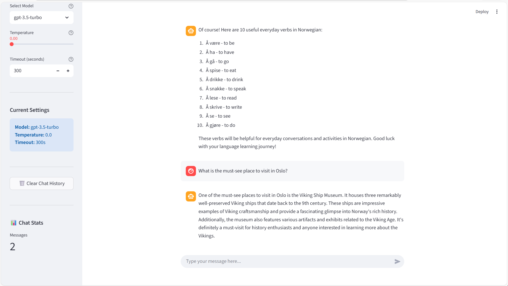

# 🤖 AI OpenAI Chatbot

A powerful and interactive chatbot application built with Streamlit and LangChain, featuring a clean UI and customizable AI model settings.


## ✨ Features

- 🎨 **Beautiful UI**: Gradient-styled interface with custom animations
- 💬 **Real-time Chat**: Interactive conversation with AI
- ⚙️ **Customizable Settings**: Adjust model, temperature, and timeout
- 🔄 **Multiple Models**: Support for GPT-3.5-turbo, GPT-4, and GPT-4-turbo
- 📊 **Chat Statistics**: Track conversation metrics
- 💾 **Chat History**: Persistent conversation memory
- 🎯 **Centered Loading**: Professional thinking animation

## 📸 Screenshots

### Main Chat Interface


### Settings Sidebar


## 🚀 Getting Started

### Prerequisites

- Python 3.8 or higher
- OpenAI API key
- pip package manager

### Installation

1. **Clone the repository**
```bash
   git clone https://github.com/AzadeHajian/ai-openai-chatbot.git
   cd ai-openai-chatbot
```

2. **Create a virtual environment**
```bash
   python -m venv .venv
   
   # On Windows
   .venv\Scripts\activate
   
   # On macOS/Linux
   source .venv/bin/activate
```

3. **Install dependencies**
```bash
   pip install -r requirements.txt
```

4. **Set up environment variables**
   
   Create a `.env` file in the root directory:
```env
   OPENAI_API_KEY=your_openai_api_key_here
   LANGSMITH_TRACING=false
```

### 📦 Requirements
```txt
streamlit>=1.28.0
langchain>=0.1.0
langchain-openai>=0.0.2
python-dotenv>=1.0.0
openai>=1.0.0
```

## 💻 Usage

1. **Run the Streamlit application**
```bash
   streamlit run app.py
```

2. **Access the application**
   
   Open your browser and navigate to:
```
   http://localhost:8501
```

3. **Start chatting!**
   - Type your message in the chat input
   - Adjust settings in the sidebar (model, temperature, timeout)
   - Clear chat history with the button in sidebar

## ⚙️ Configuration Options

### Model Selection
- **gpt-3.5-turbo** (Default): Fast and cost-effective
- **gpt-4**: More capable and accurate
- **gpt-4-turbo**: Balanced performance and speed

### Temperature Settings
- **0.0 - 0.3**: Focused, deterministic responses
- **0.4 - 0.7**: Balanced creativity
- **0.8 - 2.0**: More creative and random outputs

### Timeout
- Range: 30 - 600 seconds
- Default: 300 seconds

## 📁 Project Structure
```
ai-openai-chatbot/
│
├── app.py                 # Streamlit frontend
├── main.py                # Backend logic and LLM functions
├── .env                   # Environment variables (not tracked)
├── requirements.txt       # Python dependencies
├── README.md             # Project documentation
│
├── pics/                 # Screenshots folder
│   ├── screenshot1.png
│   └── screenshot2.png
│
└── .venv/                # Virtual environment (not tracked)
```

## 🛠️ Technologies Used

- **[Streamlit](https://streamlit.io/)**: Web framework for the UI
- **[LangChain](https://python.langchain.com/)**: Framework for LLM applications
- **[OpenAI API](https://openai.com/)**: AI model provider
- **[Python-dotenv](https://github.com/theskumar/python-dotenv)**: Environment variable management

## 🔧 Development

### Testing the Backend

You can test the backend independently:
```bash
python main.py
```

This will run a simple test query to verify your API key and LLM setup.

### Customizing the AI

Modify the system prompt in `main.py`:
```python
system_prompt = "You are a helpful assistant, answer and guide the user."
```

## 🤝 Contributing

Contributions are welcome! Please feel free to submit a Pull Request.

1. Fork the project
2. Create your feature branch (`git checkout -b feature/AmazingFeature`)
3. Commit your changes (`git commit -m 'Add some AmazingFeature'`)
4. Push to the branch (`git push origin feature/AmazingFeature`)
5. Open a Pull Request

## 📝 License

This project is licensed under the MIT License - see the [LICENSE](LICENSE) file for details.

## 🙏 Acknowledgments

- OpenAI for providing the GPT models
- Streamlit for the amazing web framework
- LangChain for the LLM integration tools

## 📧 Contact

Azade Hajian - [@AzadeHajian](https://github.com/AzadeHajian)

Project Link: [https://github.com/AzadeHajian/ai-openai-chatbot](https://github.com/AzadeHajian/ai-openai-chatbot)

## ⚠️ Troubleshooting

### API Key Issues
If you see "OPENAI_API_KEY not found":
- Verify your `.env` file exists
- Check that the API key is correctly formatted
- Ensure the `.env` file is in the root directory

### LangSmith Errors
If you see LangSmith 403 errors:
- Set `LANGSMITH_TRACING=false` in your `.env` file
- Or add your LangSmith API key if you want tracing enabled

### Model Access
If you get model access errors:
- Verify your OpenAI account has access to the selected model
- Check your API key permissions
- Try using `gpt-3.5-turbo` first (available to all accounts)

---

⭐ **Star this repo** if you find it helpful!